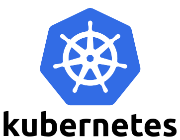
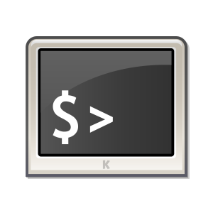

## Docker-ssh





## Description
调试K8S环境中容器常规操作通过kubectl或者telepresence代理形式，如果没有具体的操作权限可以通过ssh方式附加到Pod中调试目标容器。

* 简单示例
```
user <--> browser <--> Pod[docker-ssh <--> target container]
```

## 依赖
* [webssh](https://github.com/huashengdun/webssh)
* openssh-server

## 目录
* keys 存放ssh公钥文件
* src webssh源码
* Dockerfile
* entrypoint.sh 容器运行前执行一些操作
* respositories 软件源（根据本地网络情况可忽略）

## Usage

* step1
```
# SSH公钥私钥配置
1. ssh-keygen
2. copy id_rsa.pub ./keys
```

* step2
```
# 构建镜像
docker build -t "docker-ssh:v0.0.1" .
```

* step3
```
1. 调整Pod的yaml文件配置，添加`docker-ssh`容器到配置中,

2. 登陆webssh
```
